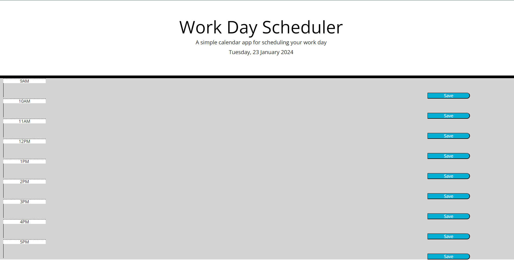
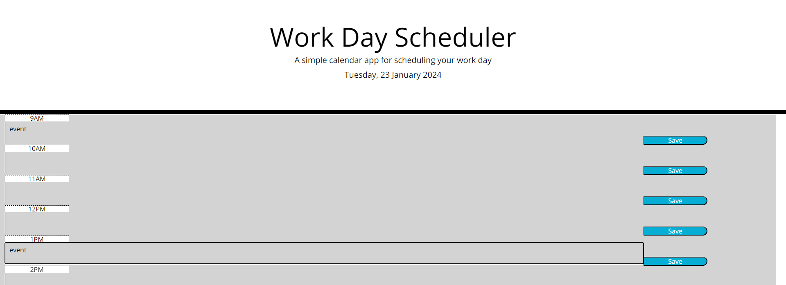
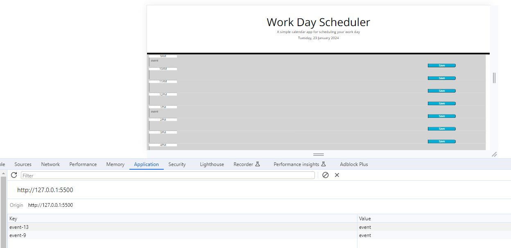

# Work Day Scheduler

## Description 

Welcome to my Work Day Scheduler! This simple web application allows users to plan their day by providing a visual representation of time blocks for standard business hours. Users can add events to each time block and save them locally.

## Features

* Current Day Display: The current day is prominently displayed at the top of the calendar when the user opens the planner.

* Time Blocks: Time blocks for standard business hours (9 AM to 5 PM) are presented to the user. Each time block includes an hour indicator, a text area for event input, and a save button.

* Color-Coded Time Blocks: Time blocks are color-coded to indicate whether they are in the past, present, or future, providing a visual cue for users.

* Local Storage: Events entered by the user are saved in the local storage.

## Usage

1. Current Day Display: The current day is automatically displayed at the top of the planner.

2. Time Blocks: Scroll down to view the time blocks for standard business hours. Each time block is color-coded based on its temporal relation to the current time.

3. Event Input: Enter your events in the provided text area within each time block.

4. Save Button: Click the "Save" button to save the entered event for the corresponding time block.

5. Local Storage: Events are stored locally.

## References

* HTML, CSS, and JavaScript All-In-One for Dummies (McFedries, P. (2023) ‘4 Building Dynamic Pages with JavaScript’, in HTML, CSS, & javascript: All-in-one. Hoboken, NJ: John Wiley & Sons, Inc. )
* https://www.w3schools.com/
* https://www.freecodecamp.org/
* https://developer.mozilla.org/en-US/
* Xpert Learning Assistant

